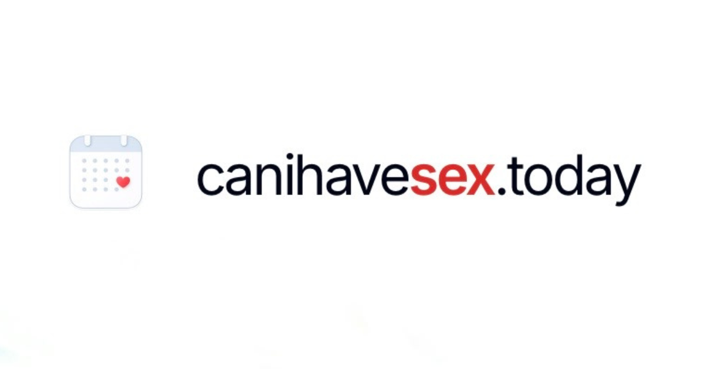

<p align="center">
  
</p>

<p align="center">
  A private, open-source period &amp; fertility-awareness app.<br />
</p>

<p align="center">
  <a href="LICENSE"></a>
  <a href="#self-hosting"></a>
  <a href="#what-it-is"></a>
  <a href="CONTRIBUTING.md"></a>
</p>

<p align="center">
  <a href="https://canihavesex.today/?utm_source=github&utm_medium=readme"><strong>canihavesex.today</strong></a>
  &nbsp;·&nbsp;
  <a href="https://app.canihavesex.today/?demo=1"><strong>Live demo</strong></a>
  &nbsp;·&nbsp;
  <a href="#self-hosting"><strong>Self-host</strong></a>
</p>

> Not medical advice, and not a contraceptive. See the [Disclaimer](#disclaimer).

## What it is

**[canihavesex.today](https://canihavesex.today/?utm_source=github&utm_medium=readme) is a self-hosted, open-source period tracker** — a private,
privacy-first alternative to mainstream cycle apps. No ads, no tracking, no data-harvesting.

From the signals you log (bleeding, basal body temperature, cervical fluid, LH tests),
one open-source engine estimates today's fertility status alongside your cycle context —
cycle day, fertile window, next-period estimate. When the signal is unclear, it assumes
you're fertile; it never implies contraceptive safety. It's grounded in the
[symptothermal method](https://canihavesex.today/methodology?utm_source=github&utm_medium=readme).

- **Fertility-led and honest** — today's status is the headline, never a false sense of safety.
- **Calm and minimal** — no ads, no upsells, no gamification.
- **Yours** — your data stays on your own instance. Self-host it in minutes.

## Features

- Daily logging — flow, BBT, cervical fluid, LH tests, plus mood, energy, sleep, libido, notes
- Today's fertility status with a confidence signal, and cycle context (calendar, trends)
- Email + password out of the box; Google / OIDC optional
- CSV export of your own data
- Mobile-first PWA, light and dark themes

## Demo

<p align="center">
  <a href="https://app.canihavesex.today/?demo=1">
    
  </a>
</p>
<p align="center">
  <em>Drops you straight into a sample account, no signup needed.</em>
</p>

## Self-hosting

The easiest path is Docker. One app container + Postgres, configured by a single `.env`.

```bash
docker pull ghcr.io/neizsche/canihavesex:latest
```

```bash
curl -O https://raw.githubusercontent.com/neizsche/canihavesex.today/main/docker-compose.yml
```

```bash
printf 'COOKIE_SECRET=%s\nPOSTGRES_PASSWORD=%s\n' "$(openssl rand -hex 32)" "$(openssl rand -hex 16)" > .env
```

```bash
docker compose up -d
```
**Next steps:** Open <http://localhost:3112>. Email/password works out of the box. Database migrations run automatically. (Optional: Set Google/OIDC variables in `.env` to enable SSO).

<details>
<summary><strong>Maintenance Commands</strong></summary>

<br/>

| Action             | Command                                                                                               |
| :----------------- | :---------------------------------------------------------------------------------------------------- |
| **Update**         | `docker compose pull && docker compose up -d`                                                         |
| **Backup**         | `docker compose exec db pg_dump -U canihavesex canihavesex > backup.sql`                              |
| **Restore**        | `cat backup.sql \| docker compose exec -T db psql -U canihavesex canihavesex`                         |
| **Reset Password** | `docker compose exec app node apps/backend/dist/scripts/resetPassword.js user@email.com new_password` |

</details>


## Learn more

- [Methodology](https://canihavesex.today/methodology?utm_source=github&utm_medium=readme) — the science behind today's status
- [Privacy](https://canihavesex.today/privacy?utm_source=github&utm_medium=readme) — what we store, and what we never do
- [Why open source](https://canihavesex.today/open-source?utm_source=github&utm_medium=readme) — transparency and self-hosting

## Disclaimer

This is fertility-awareness software. It is **not medical advice** and **not a
contraceptive**, and it does not guarantee pregnancy prevention. When in doubt, assume you
are fertile, and consult a healthcare professional for medical decisions.

## Contributing & License

Contributions welcome — see [CONTRIBUTING.md](./CONTRIBUTING.md). Licensed under
[GNU AGPL-3.0](./LICENSE): run a modified version as a network service and you must share
your source under the same license. Running it privately for a single household does not
trigger that requirement.
