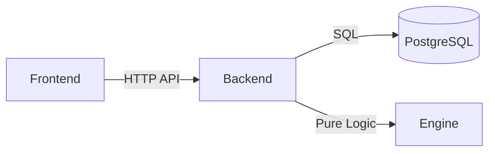

# canihavesex.today

A private, open-source **period + fertility-awareness** app. It answers one honest
question — *am I likely fertile today?* — and tracks your cycle, with no ads, no
tracking, and no data-harvesting.

> Not medical advice, and not a contraceptive. See the [Disclaimer](#disclaimer).

## What it is

canihavesex.today brings together period tracking and fertility awareness — two
sides of one cycle. From the signals you log (bleeding, basal body temperature,
cervical fluid, LH tests), it estimates today's fertility status alongside your
cycle context (cycle day, fertile window, next-period estimate).

Design principles:

- **Fertility-led and honest.** Today's status is the headline; period insights sit
  alongside it. When the signal is unclear, it assumes you're fertile — it never
  implies contraceptive safety.
- **Calm and minimal.** No ads, no upsells, no gamification.
- **Yours.** Your data stays on your own instance. Self-host it in minutes.

## Features

- Daily logging: bleeding/flow, BBT, cervical fluid, LH tests — plus symptoms,
  mood, energy, sleep, libido, and notes
- Today's fertility status with a confidence signal
- Cycle context: cycle day, fertile window, next-period estimate, calendar, trends
- Email + password accounts out of the box (Google / OIDC optional)
- CSV export of your own data
- Mobile-first PWA with light and dark themes

## Tech stack & Architecture

- **Frontend:** Astro + React (static SPA), Tailwind
- **Backend:** Node.js (Fastify) + TypeScript
- **Database:** PostgreSQL



- **Frontend (`apps/frontend`)**: Astro static pages + React UI. State is managed by React Query.
- **Backend (`apps/backend`)**: Fastify API. `src/engine.ts` holds the pure, deterministic business logic that calculates fertility status.

## Self-hosting

The easiest path is Docker. One app container + Postgres, configured by a single `.env`.

```bash
git clone https://github.com/neizsche/canihavesex.today.git
cd canihavesex.today
printf 'COOKIE_SECRET=%s\nPOSTGRES_PASSWORD=%s\n' "$(openssl rand -hex 32)" "$(openssl rand -hex 16)" > .env
docker compose up -d
```

Open <http://localhost:3112> and create an account. Migrations run automatically on boot and are non-destructive.

**Maintenance Commands:**
- **Update:** `docker compose pull && docker compose up -d`
- **Backup:** `docker compose exec db pg_dump -U canihavesex canihavesex > backup.sql`
- **Restore:** `cat backup.sql | docker compose exec -T db psql -U canihavesex canihavesex`
- **Reset Password:** `docker compose exec app node apps/backend/dist/scripts/resetPassword.js user@email.com new_password`

## Local development

Requires Node 22 and a PostgreSQL database.

```bash
npm install
cp .env.example .env     # set COOKIE_SECRET (openssl rand -hex 32) and DATABASE_URL
npm run dev              # backend on :1299, frontend on :3112
```

## Authentication

Email + password is the built-in default, so a fresh install needs no external
accounts. Google OAuth and generic OIDC activate automatically when their env vars
are set in `.env` — the sign-in screen adapts to whatever is configured.

## How this app works

You log what your body tells you each day — bleeding, basal body temperature, cervical fluid, and LH tests. Behind the scenes, one open-source engine turns those signals into a single daily answer.

One rule guides every call: **when the signal is unclear, it assumes you're fertile.** It never implies it's safe to skip protection. 

## Disclaimer

This is fertility-awareness software. It is **not medical advice** and **not a
contraceptive**, and it does not guarantee pregnancy prevention. When in doubt,
assume you are fertile, and consult a healthcare professional for medical decisions.

## Contributing

See [CONTRIBUTING.md](./CONTRIBUTING.md).

## License

[GNU AGPL-3.0](./LICENSE). If you run a modified version as a network service, you
must make your source available under the same license. Running the app privately for a single household (homelab) does not trigger the AGPL requirement to publish source code or modifications.
